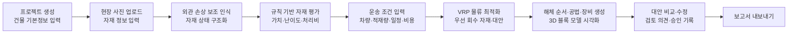

# AI 기반 건물 해체 및 재사용 자재 계획 시스템

> 건축 연도, 현장 사진과 사용자가 입력한 자재 정보로 **콘크리트·골재와 구조용 강재의 재사용 가능성을 평가**하고, **운송 물류를 최적화**하며, **해체 순서·공법·장비 대안**을 간소화된 3D 블록 모델과 보고서로 제공하는 해체 계획 지원 시스템입니다.

- 웹사이트: https://mungim5556-ui.github.io/nijja/
- 성격: 학부 캡스톤 프로젝트 (1차 프로토타입)
- 상태: 기획 단계 (전체 요구사항 `todo`)
- 기획 원본: Manyfast 프로젝트 「AI 기반 건물 해체 및 재사용 자재 계획 시스템」

> ⚠️ **이 시스템의 결과는 전문가 검토를 돕는 1차 스크리닝 자료입니다.** 법적·기술적 최종 승인이나 정밀 진단을 대신하지 않습니다. 실제 착공 전에는 자격을 갖춘 전문가의 검토와 관계기관 승인을 반드시 받아야 합니다.

---

## 목차

1. [배경과 해결하려는 문제](#배경과-해결하려는-문제)
2. [해결 방법](#해결-방법)
3. [차별점](#차별점)
4. [대상 사용자와 역할](#대상-사용자와-역할)
5. [사용 흐름](#사용-흐름)
6. [주요 기능 (1차 범위)](#주요-기능-1차-범위)
7. [구현 범위: 1차와 Phase 2](#구현-범위-1차와-phase-2)
8. [성공 지표 (KPI)](#성공-지표-kpi)
9. [리스크와 제한 사항](#리스크와-제한-사항)
10. [기술 스택 및 실행 방법](#기술-스택-및-실행-방법)

---

## 배경과 해결하려는 문제

기존 건물 해체 계획은 현장 조사, 자재 가치 평가, 해체 순서 수립, 운송 계획을 여러 전문가가 손으로 나눠 맡기 때문에 시간과 비용이 많이 듭니다. 재사용 가능한 자재를 가려내면서 해체·운송 비용까지 함께 따지는 경제성 분석도 어려워, 계획의 품질이 담당자의 경험에 크게 좌우됩니다.

사용자가 겪는 핵심 문제는 다음과 같습니다.

- 제한된 자료로 짧은 시간 안에 **안전하고 경제적인** 해체 계획을 세워야 합니다.
- 콘크리트·골재와 구조용 강재의 **상태·가치·해체 난이도를 정량적으로 판단**하기 어렵습니다.
- 차량 종류·적재량·일정·비용을 함께 고려한 **운송 계획**을 만들기 어렵습니다.
- 해체 순서와 공법을 수작업으로 검토하면 **누락과 비효율**이 생깁니다.

## 해결 방법

| 단계 | 방법 |
|---|---|
| 입력 구조화 | 건축 연도, 현장 사진, 자재의 재질·규격·위치·외관 상태를 구조화된 데이터로 정리 |
| 외관 손상 인식 | 경량 이미지 분류 모델로 사진 속 균열·변색 등 외관 손상을 **보조 인식** |
| 자재 평가 | 재사용 가능성·예상 가치·해체 난이도·처리비를 **규칙 기반 스코어링**으로 산정 |
| 물류 최적화 | **차량경로최적화(VRP)** 알고리즘으로 운송수단·일정·비용 대안 비교 |
| 계획 제시 | 해체 순서·공법·장비 조합을 **부재 단위의 간소화된 3D 블록 모델**과 검토용 보고서로 제공 |

## 차별점

일반 해체 관리 도구는 일정·작업 관리나 단순 물량 산출에 집중합니다. 이 시스템은 **자재 재사용 가치 평가, 해체 난이도, 운송 물류 최적화를 하나의 흐름으로 묶습니다.** 입력한 자재 정보와 현장 사진으로 자재 위치와 해체 순서를 간단히 시각화하고, 비용과 효율을 수치로 비교할 수 있는 대안을 제공합니다.

## 대상 사용자와 역할

**주요 사용자**: 실무 지식은 있지만 고급 3D 분석이나 물류 최적화 도구를 따로 쓰기 어려운 사람

- 중소·중견 해체업체의 해체계획 담당자
- 건설·구조·해체 분야 기술자
- 공공기관의 건축물 철거 및 자원순환 담당자
- 재개발·리모델링을 추진하는 건물 소유자

**시스템 역할**

| 역할 | 역할 | 역할 |
|---|---|---|
| 시스템 관리자 | 해체업체 관리자 | 해체계획 담당자 |
| 구조·건설 기술자 | 공공기관 검토자 | 건물 소유자 |
| 승인권자 | | |

**지원 환경**: 웹, 데스크톱, 모바일

## 사용 흐름



1. 프로젝트를 만들고 건물 주소, 용도, 규모, 건축 연도, 해체 예정일을 입력합니다.
2. 현장 사진을 올리고 콘크리트·골재와 구조용 강재의 재질·규격·위치·외관 상태를 반구조화된 형식으로 입력합니다.
3. 시스템이 사진에서 균열·변색 등 외관 손상을 보조 인식하고, 입력 정보와 합쳐 자재 상태를 구조화합니다.
4. 시스템이 자재별 재사용 가능성, 예상 가치, 해체 난이도, 예상 처리비를 규칙 기반으로 산출합니다.
5. 운송거리, 차량 유형, 적재량, 운송 일정, 비용 조건을 입력하거나 추천값을 확인합니다.
6. 시스템이 재사용 가치와 해체·운송 비용을 종합하고, VRP로 우선 회수 자재와 경제성 높은 대안을 제시합니다.
7. 시스템이 해체 순서·공법·장비 조합을 만들고 3D 블록 모델에서 단계별로 보여줍니다.
8. 사용자가 대안을 비교·수정하고 기술 검토 의견과 승인 상태를 기록합니다.
9. 해체계획서, 자재 목록, 물류 계획, 비용 요약 보고서를 내보냅니다.

## 주요 기능 (1차 범위)

모든 요구사항의 중요도는 **높음(high)**, 진행 상태는 **todo**입니다.

### 1. 건물 정보·현장 사진 및 자재 정보 등록

프로젝트별로 건물 기본정보, 현장 사진, 자재 정보를 등록·관리합니다. 입력 정보는 규칙 기반 평가와 3D 블록 모델의 기준 데이터가 됩니다.

- [ ] 프로젝트를 만들고 주소, 용도, 규모, 건축 연도, 해체 예정일을 입력할 수 있다.
- [ ] 현장 사진을 올리고 자재별 재질, 규격, 위치, 수량, 외관 상태를 입력·수정·삭제할 수 있다.
- [ ] 필수 정보 누락, 지원하지 않는 사진 형식, 손상된 파일을 등록 단계에서 안내한다.
- [ ] 분석 전에 입력 누락 항목, 사진 품질, 추가 현장 조사 필요 여부를 표시한다.

### 2. 재사용 자재 규칙 기반 평가

등록된 콘크리트·골재와 구조용 강재의 재사용 가능성, 예상 가치, 해체 난이도, 예상 처리비를 규칙 기반 스코어링으로 평가합니다. 사진 속 외관 손상은 보조 판단 정보로 씁니다.

- [ ] 입력 정보와 사진 기반 외관 손상 인식 결과를 자재별 상태 정보로 확인할 수 있다.
- [ ] 자재마다 재사용 가능성, 예상 가치, 해체 난이도, 예상 처리비와 주요 판단 근거를 제공한다.
- [ ] 사진 품질이나 입력 정보가 부족한 자재에는 신뢰도와 추가 검토 필요성을 표시한다.
- [ ] 결과를 자재별 목록과 입력 위치 기반의 간이 화면에서 확인할 수 있다.

### 3. 해체 경제성 및 운송 물류 분석

자재 가치, 회수·해체 비용, 운송 조건을 종합해 자재별 경제성과 물류 효율을 평가합니다. 조건을 바꾸면 다시 계산합니다.

- [ ] 차량 유형, 적재 한도, 운송거리 또는 목적지, 운송 일정, 단가를 입력할 수 있다.
- [ ] 자재별 예상 회수 가치, 해체·처리비, 운송비, 순경제성을 계산한다.
- [ ] VRP 알고리즘으로 차량별 운송 경로와 적재 계획 대안을 제공한다.
- [ ] 가치, 해체 난이도, 운송비를 반영한 우선 회수 순위를 제공한다.
- [ ] 기본안과 대안의 비용, 예상 수익, 운송 횟수, 물류 효율을 비교하고 계산 가정과 가격 기준일을 표시한다.

### 4. 해체 순서·공법·장비 추천

자재 위치·상태와 평가 결과를 바탕으로 단계별 해체 순서, 공법, 장비를 제안합니다. 안전성 판단을 대신하지 않는 **검토용 대안**입니다.

- [ ] 해체 단계를 순서대로 만들고 단계마다 대상 구역, 자재, 공법, 장비를 표시한다.
- [ ] 추천 단계마다 입력 정보, 자재 평가 결과, 규칙 기반 추천 근거를 제공한다.
- [ ] 사용자가 단계 순서, 장비, 공법을 수정하고 저장할 수 있다.
- [ ] 입력 정보나 평가 신뢰도가 낮은 단계는 추가 검토 필요 상태로 표시한다.
- [ ] 추천 결과가 최종 시공·해체 지시가 아닌 전문가 검토용 계획임을 명확히 표시한다.

### 5. 간소화된 3D 해체 계획 시각화

자재 위치와 해체 계획을 부재 단위의 3D 블록 모델에 단계별로 표시합니다.

- [ ] 단계 재생, 일시정지, 이전·다음 단계 이동으로 해체 과정을 확인할 수 있다.
- [ ] 재사용 대상 자재와 일반 처리 대상 자재를 다른 색이나 상태로 구분한다.
- [ ] 블록을 선택하면 자재 종류, 수량, 예상 가치, 해체 단계, 신뢰도를 확인할 수 있다.
- [ ] 운송 경로, 적재 단위, 장비 작업 위치를 계획 화면에서 확인할 수 있다.
- [ ] 위치 정보가 부족하면 간이 평면이나 목록 화면으로 대신 보여준다.

### 6. 검토·승인 및 결과 보고서

분석 결과를 초안부터 승인까지 검토 흐름으로 관리하고, 승인된 결과를 보고서로 내보냅니다.

- [ ] 결과를 초안 → 검토 중 → 수정 요청 → 승인 / 반려 상태로 관리할 수 있다.
- [ ] 검토자가 의견, 수정사항, 승인 이력을 프로젝트에 기록할 수 있다.
- [ ] 승인되지 않은 결과에는 업무 적용 전 전문가 검토 필요 상태를 표시한다.
- [ ] 승인된 결과를 PDF나 표 형식 파일로 내보낼 수 있다.
- [ ] 보고서에 입력 데이터, 분석 일시, 주요 가정, 신뢰도, 비용 산출 근거, 전문가 승인 정보, 1차 구현 범위의 제한을 포함한다.

## 구현 범위: 1차와 Phase 2

| 구분 | 1차 구현 (프로토타입) | Phase 2 |
|---|---|---|
| 입력 데이터 | 사용자 입력 자재 정보, 현장 사진 | CAD 도면 자동 인식, 3D 스캔 자동 구조 추출 |
| 상태 진단 | 사진 기반 외관 손상 보조 인식 | 3D 스캔 기반 부식·손상 추정, 내부 결함 탐지 |
| 자재 평가 | 규칙 기반 스코어링 | — |
| 안전성 | 검토용 대안 제시, 신뢰도 표시 | 구조 안전성 시뮬레이션 |
| 시각화 | 부재 단위의 간소화된 3D 블록 모델 | 고해상도 3D 스캔 연동, 정밀 해체 시뮬레이션 |
| 대상 자재 | 콘크리트·골재, 구조용 강재 | (확장 검토) |

## 성공 지표 (KPI)

**초기 목표**

| 지표 | 목표 |
|---|---|
| 해체 계획 수립 시간 단축률 (기존 방식 대비) | 50% 이상 |
| 분석 결과 전문가 승인율 | 70% 이상 |
| 외관 손상 분류 정확도 | 80% 이상 |
| 물류 최적화에 따른 운송비 절감률 | 15% 이상 |
| 운송비 예측 오차 | 20% 이내 |

**추가 관찰 지표**: 프로젝트당 분석 완료 시간, 재사용 가능 자재 식별 정확도, 예상 재사용 가치 대비 실제 회수 가치 오차율, 계획 변경 횟수 감소율, 월간 활성 프로젝트 수, 생성 계획의 재사용률

## 리스크와 제한 사항

- **입력 품질**: 입력 정보의 누락·오류나 사진 화질 차이로 자재 상태를 잘못 추정할 수 있습니다.
- **외관 정보의 한계**: 외관만으로는 콘크리트 내부 상태나 강재의 부식·손상을 정확히 알 수 없습니다. 결과는 1차 스크리닝 참고 자료이며, 최종 판단은 전문가 현장 조사에 따릅니다.
- **안전**: 잘못된 해체 순서 제안은 안전사고로 이어질 수 있습니다.
- **외부 요인**: 지역별 해체·건설폐기물·운송 규정과 시장가격 변화가 분석 신뢰도에 영향을 줍니다.

**대응 원칙**

- 모든 결과에 데이터 품질, 신뢰도, 주요 가정, 불확실성을 표시합니다.
- 실제 착공 전 자격을 갖춘 전문가 검토와 관계기관 승인을 필수로 둡니다.
- 1차 구현에 도면 자동 분석과 3D 스캔 기반 정밀 진단이 없다는 점을 화면과 보고서에 명시합니다.

## 기술 스택 및 실행 방법

현재 프로토타입은 빌드 과정이 없는 정적 웹사이트입니다. 서버·데이터베이스 없이 브라우저에서만 동작하고, 입력 내용은 브라우저 저장소(localStorage)에 저장됩니다.

| 영역 | 사용 기술 |
|---|---|
| 화면 | HTML, CSS(디자인 토큰은 [design.md](design.md) 기준), 순수 JavaScript(ES 모듈) |
| 3D 블록 모델 | [three.js](https://threejs.org) 0.160 (CDN) |
| 자재 평가 | 규칙 기반 스코어링 ([engine.js](assets/js/engine.js)) |
| 물류 최적화 | 용량 제약 VRP, Clarke-Wright savings 알고리즘 ([engine.js](assets/js/engine.js)) |
| 폰트 | Pretendard, Sora, JetBrains Mono (CDN) |

**실행 방법**: ES 모듈을 쓰기 때문에 파일을 더블클릭하지 말고 로컬 서버로 여세요.

- **VS Code (권장)**: 폴더를 VS Code로 열면 오른쪽 아래에 추천 확장 **Live Server** 설치 안내가 뜹니다. 설치한 뒤 `index.html`을 열고 오른쪽 아래 **Go Live**를 누르면 `http://localhost:5500` 에서 열립니다. 파일을 저장하면 화면이 자동으로 새로고침됩니다.
- **Python이 있다면**: `python -m http.server 5173` 실행 후 `http://localhost:5173`

앱 화면의 **예시 프로젝트 불러오기**로 샘플 데이터를 볼 수 있습니다.

**파일 구성**

```
index.html            랜딩 페이지
app.html              해체 계획 앱 (6단계)
assets/css/styles.css 디자인 토큰·공통 컴포넌트
assets/css/landing.css, app.css
assets/js/engine.js   입력 점검, 자재 평가, VRP 물류, 해체 계획 생성
assets/js/app.js      화면 구성과 상태 관리
assets/js/viewer3d.js 3D 블록 모델
assets/js/demo.js     예시 프로젝트 데이터
assets/js/icons.js    아이콘 (Lucide 기반)
```

**아직 연동되지 않은 부분**

- 경량 이미지 분류 모델의 자동 손상 인식: 지금은 사진을 보고 손상 태그를 직접 고릅니다. 사진은 해상도와 밝기만 자동 점검합니다.
- 단가·거리 값은 프로토타입용 가정값이며, 목적지 위치는 거리·방위로 단순화했습니다.
- 여러 사용자가 함께 쓰는 서버·로그인은 없습니다. 역할은 화면 상단에서 바꿔 가며 검토·승인 흐름을 시험할 수 있습니다.
